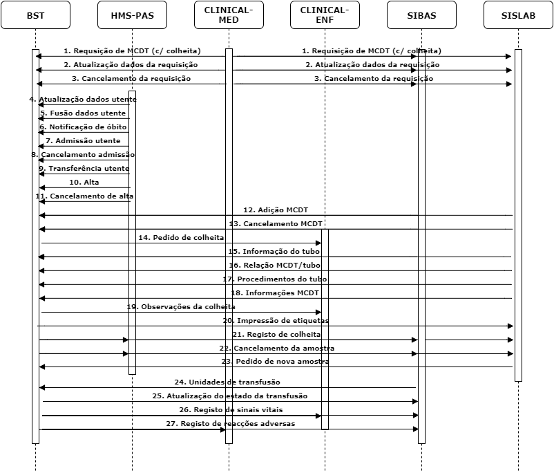

# Introdução

O presente documento tem como objetivo detalhar os interfaces necessários para a implementação do workflow de integração com o produto Bedside Tracker (BST). 

# Especificação funcional

O download do documento de especificação funcional pode ser feito [aqui](https://drive.google.com/open?id=132bLN9AtKBgBHMBy8DLG-sE6Nrg0gDBb)

## Workflow

Apesar do diagrama abaixo fazer referência a produtos Globalcare, pretende-se que o fluxo a implementar seja agnóstico relativamente ao ecossistema onde se encontra inserido, funcionando de forma semelhante consoante integra com produtos internos ou com produtos de terceiros.

| # | Descrição                                 | Origem     | Destino    |
|:-:|:----------------------------------------- |:----------:|:----------:|    
| **1** |Quando é realizada uma requisição de um MCDT que implique uma colheita, esta deve ser notificada ao BST. **Informação a passar para BST:** Número da requisição, prioridade, data do pedido, informação clínica e estado. Em simultâneo com o envio dos dados da requisição, deve ser também passado o histórico de problemas, diagnósticos, alergias e reacções adversas ativas do utente.|CLINICAL-MED|BST;SIBAS;SISLAB|        
| **2** |Quando a informação de uma requisição com colheita pendente é atualizada, esta deve ser também atualizada no BST.|CLINICAL-MED|BST;SIBAS;SISLAB|        
| **3** |Quando uma requisição com colheita pendente é cancelada, o BST deve ser informado.|CLINICAL-MED|BST;SIBAS;SISLAB|        
| **4** |O BST irá receber todas as atualizações de utentes ocorridas no HMS-PAS, devendo descartar aquelas que se refiram a utentes que não existam no sistema.|HMS-PAS     |BST  	      |
| **5** |O BST irá receber todas as fusões de utentes ocorridas no HMS-PAS, devendo descartar aquelas que se refiram a utentes que não existam no sistema.|HMS-PAS     |BST  	      |
| **6** |O BST irá receber todas as notificações de óbitos registados no HMS-PAS, devendo descartar aquelas que se refiram a utentes que não existam no sistema.|HMS-PAS     |BST  	      |
| **7** |O BST irá receber todas as admissões registadas no HMS-PAS, devendo descartar aquelas que se refiram a utentes que não existam no sistema.|HMS-PAS     |BST  	      |
| **8** |O BST irá receber todos os cancelamentos de admissões registados no HMS-PAS, devendo descartar aqueles que se refiram a utentes que não existam no sistema.|HMS-PAS     |BST  	      |
| **9** |O BST irá receber todas as transferências registadas no HMS-PAS, devendo descartar aquelas que se refiram a utentes que não existam no sistema.|HMS-PAS     |BST  	      |
| **10** |O BST irá receber todas as altas registadas no HMS-PAS, devendo descartar aquelas que se refiram a utentes que não existam no sistema.|HMS-PAS     |BST  	      |
| **11** |O BST irá receber todos os cancelamentos de altas registados no HMS-PAS, devendo descartar aqueles que se refiram a utentes que não existam no sistema.|HMS-PAS     |BST  	      |
| **12** |O laboratório pode adicionar MCDTs à requisição. Esta situação deve ser comunicada ao BST e CLINICAL-MED|SIBAS;SISLAB|BST;CLINICAL-MED|
| **13** |O laboratório pode cancelar MCDTs constantes da requisição. Esta situação deve ser comunicada ao BST e CLINICAL-MED|SIBAS;SISLAB|BST;CLINICAL-MED|
| **14** |Cada nova colheita disponibilizada no BST deve estar visível para a enfermagem, como tal deve ser criado na enfermagem uma intervenção no Clinical-ENF.     		      |BST         |CLINICAL-ENF|
| **15** |A informação dos tubos deve ser fornecida ao BST pelos serviços executantes.|SIBAS;SISLAB|BST  	      |
| **16** |A relação entre os MCDTs a colher e os respetivos tubos deve ser enviada ao BST.|SISLAB      |BST  	      |
| **17** |O SISLAB deve enviar ao BST os procedimentos associados aos tubos. A colheita do tubo em questão deve ter em conta o tempo em minutos que depende do procedimento.       		|SISLAB      |BST  	      |
| **18**|No SISLAB, cada análise pode ter um conjunto de informações associadas. Essas informações devem ser enviadas para o BST, sendo que no SISLAB já contém o valor da chave a introduzir no BST.|SISLAB      |BST  	      |
| **19** |No BST vai ser possível o registo de observações da colheita associadas ao doente. Essas observações registadas devem ser integradas no Clinical-ENF.       		       |BST         |CLINICAL-ENF|
| **20** |A impressão de etiquetas deve ser notificada ao SISLAB.|BST         |SISLAB	  |
| **21** |Quando uma colheita é registada no BST, esse evento deve ser notificado aos sistemas subscritores.|BST         |HMS-PAS;SIBAS;SISLAB|
| **22** |Quando uma amostra é cancelada no BST, esse evento deve ser notificado aos sistemas subscritores.|BST         |HMS-PAS;SIBAS;SISLAB|
| **23** |Para cada amostra colhida, o laboratório pode inativar uma amostra e pedir uma nova. Quando o laboratório pedir nova amostra, o interface deve colocar a amostra no BST como rejeitada com o respetivo motivo, e criar uma nova amostra pendente de colheita com a informação a ser disponibilizada pelo laboratório.|SISLAB      |BST  	      |
| **24** |As unidades sanguíneas devem ser disponibilizadas no BST a partir do momento que for dada essa indicação no SIBAS.|SIBAS       |BST  	      |
| **25** |Sempre que o estado de uma transfusão é alterado do lado do BST, esta deve ser notificada para os sistemas subscitores.|BST         |SIBAS	  	  |
| **26** |Sempre que são efetuados registos de sinais vitais no BST, esta informação deve ser notificada para os sistemas subscitores.|BST         |CLINICAL-ENF;SIBAS|
| **27**|Sempre que são efetuados registos de reacções adversas no BST, esta informação deve ser notificada para os sistemas subscitores.|BST         |CLINICAL-MED;SIBAS|

***

# Especificação técnica

O interface será implementado com recurso ao standard HL7, na sua versão 2.4.

No capítulo abaixo, encontram-se detalhados todos os conectores de interfaces que são necessários instalar neste âmbito.

##Conectores

De forma a montar o circuito funcional especificado, será necessário instalar os seguintes conectores de integração:

###BST Patient Administration

| Código | Operação                                 | Mensagem HL7 | In/Out |
|:------:|:-----------------------------------------|:------------:|:------:|    
| G01002 |Alteração de dados demográficos de utentes|[ADT^A08](../hl7/#adta08-update-patient-information)|&larr;  |        
| G01003 |Fusão de dados do utente			        |[ADT^A34](../hl7/#adta34-merge-patient-information-patient-id-only)|&larr;  |        
| G01005 |Notificação de óbito       		        |[ADT^A08](../hl7/#adta08-update-patient-information)|&larr;  |        
| G02001 |Admissão à Urgência						|[ADT^A04](../hl7/#adta04-register-a-patient)|&larr;  |        
| G02002 |Cancelamento da admissão à Urgência		|[ADT^A11](../hl7/#adta11-cancel-admitvisit-notification)|&larr;  |        
| G02003 |Transferência na Urgência       		    |[ADT^A02](../hl7/#adta02-transfer-a-patient)|&larr;  |
| G02004 |Alta da Urgência							|[ADT^A03](../hl7/#adta03-dischargeend-visit)|&larr;  |        
| G02005 |Cancelamento da alta da Urgência       	|[ADT^A13](../hl7/#adta13-cancel-dischargeend-visit)|&larr;  |
| G03001 |Admissão à Consulta externa				|[ADT^A04](../hl7/#adta04-register-a-patient)|&larr;  |        
| G03002 |Cancelamento da admissão à Consulta externa |[ADT^A11](../hl7/#adta11-cancel-admitvisit-notification)|&larr;  |        
| G03003 |Alta da Consulta externa					|[ADT^A03](../hl7/#adta03-dischargeend-visit)|&larr;  |        
| G03004 |Cancelamento da alta da Consulta externa  |[ADT^A13](../hl7/#adta13-cancel-dischargeend-visit)|&larr;  |
| G04001 |Admissão ao Internamento					|[ADT^A01](../hl7/#adta01-admitvisit-notification)|&larr;  |        
| G04002 |Cancelamento da admissão ao Internamento	|[ADT^A11](../hl7/#adta11-cancel-admitvisit-notification)|&larr;  |        
| G04003 |Transferência no Internamento       		|[ADT^A02](../hl7/#adta02-transfer-a-patient)|&larr;  |
| G04004 |Alta do Internamento						|[ADT^A03](../hl7/#adta03-dischargeend-visit)|&larr;  |        
| G04005 |Cancelamento da alta do Internamento      |[ADT^A13](../hl7/#adta13-cancel-dischargeend-visit)  |&larr;  |
| G05007 |Registo de cirurgia  						|ORM^O01       |&larr;  |
| G06005 |Efetivação de sessão HDI					|[ADT^A04](../hl7/#adta04-register-a-patient)|&larr;  |        
| G06006 |Cancelamento de efetivação de sessão HDI  |[ADT^A11](../hl7/#adta11-cancel-admitvisit-notification)|&larr;  |
            

###BST Order Management

| Código | Operação                            		| Mensagem HL7 | In/Out |
|:------:|:-----------------------------------------|:------------:|:------:|    
| G07001 |Pedido de MCDT                       		|[OML^O21](../hl7/#omlo21-laboratory-order-management)|&larr;  |
| G07002 |Alteração dos dados do pedido de MCDT		|[OML^O21](../hl7/#omlo21-laboratory-order-management)|&larr;  |
| G07003 |Cancelamento de pedido de MCDT       		|[OML^O21](../hl7/#omlo21-laboratory-order-management)|&larr;  |
| G07014 |Adição de MCDT       						|[OML^O21](../hl7/#omlo21-laboratory-order-management)|&larr;  |
| G07012 |Cancelamento da realização de MCDT        |[OML^O21](../hl7/#omlo21-laboratory-order-management)|&larr;  |
| G07020 |Pedido de colheita        				|[OML^O21](../hl7/#omlo21-laboratory-order-management)|&rarr;  |
| G07021 |Notificação da informação do tubo         |[ORL^O22](../hl7/#orlo22-general-laboratory-order-response-message-to-any-orl)|&larr;  |
| G07030 |Notificação da relação análise/tubo       |              |&larr;  |
| G07031 |Notificação dos procedimentos do tubo     |              |&larr;  |
| G07032 |Notificação de informações do MCDT        |[ORL^O22](http://localhost:8000/hl7/#orlo22-general-laboratory-order-response-message-to-any-orl)|&larr;  |
| G07034 |Notificação de observações da colheita    |       	   |&rarr;  |
| G07035 |Notificação da impressão de etiquetas     |       	   |&rarr;  |
| G07033 |Registo de colheita     					|[OML^O21](../hl7/#omlo21-laboratory-order-management)|&rarr;  |
| G07036 |Cancelamento da amostra     				|[OML^O21](../hl7/#omlo21-laboratory-order-management)|&rarr;  |
| G07022 |Pedido de nova amostra        			|[OML^O21](../hl7/#omlo21-laboratory-order-management)|&larr;  |
| G07037 |Registo de unidades de transfusão			|              |&larr;  |
| G07038 |Atualização de estado da transfusão		|              |&larr;  |

###BST Observation Reporting

| Código | Operação                                 | Mensagem HL7 | In/Out |
|:------:|:-----------------------------------------|:------------:|:------:|    
| G11006 |Registo de sinais vitais                  |[ORU^R01](../hl7/#orur01-unsolicited-observation-management)|&rarr;  |        
| G13004 |Registo de reacções adversas			    |[ORU^R01](../hl7/#orur01-unsolicited-observation-management)       |&rarr;  |  

